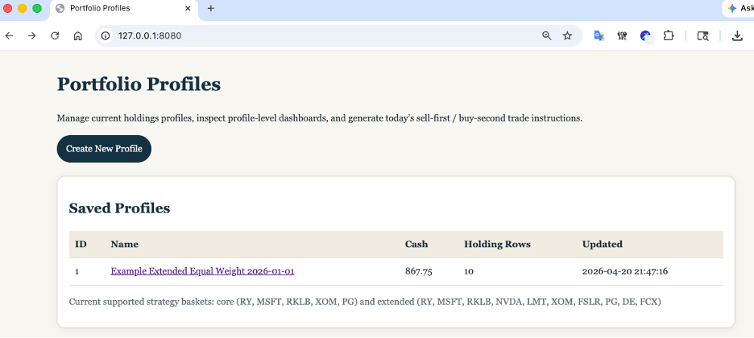
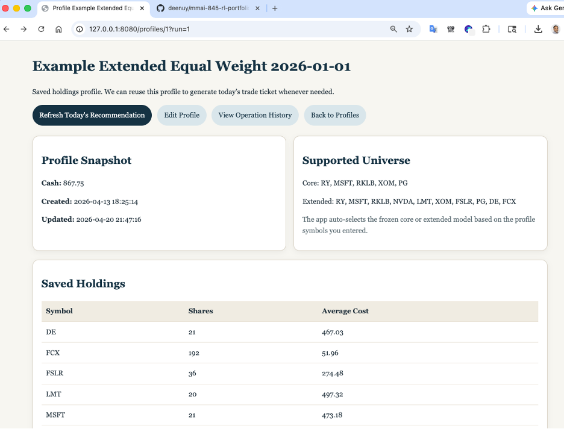
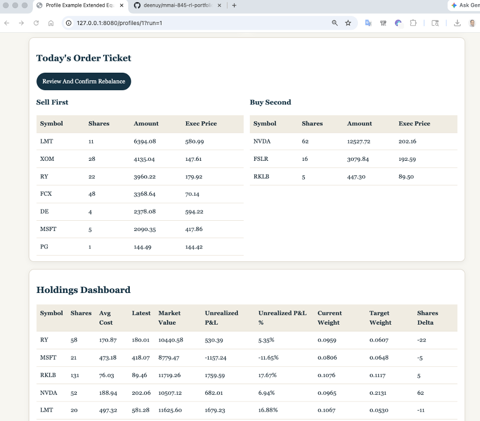

# MMAI 845 RL Portfolio Project

This project implements a reinforcement learning based portfolio management system with a local dashboard for profile-based paper trading.

The application allows a user to:

* create and manage portfolio profiles
* generate daily trade recommendations using a trained RL policy
* review and confirm rebalancing actions
* track operation history

---

## Project Structure

```
mmai-845-rl-projects/
├── artifacts/                 # Models and outputs
├── data/                      # Cached market data
├── docs/                      # Reports and documentation
├── notebooks/                 # Experiments
├── scripts/                   # Entry points
│   ├── run_product_dashboard.py
│   ├── seed_example_profiles.py
│   └── export_phase_4_paper_trading.py
├── src/rl_portfolio/          # Core logic
├── tests/unit/                # Unit tests
├── pyproject.toml
├── requirements.txt
└── uv.lock
```

---

## Requirements

* Python 3.10+
* Internet connection for market data

---

## Setup

```bash
git clone https://github.com/deenuy/mmai-845-rl-portfolio
cd mmai-845-rl-projects

python3 -m venv .venv
source .venv/bin/activate

python -m pip install --upgrade pip
```

Install dependencies (choose one):

```bash
pip install -e ".[train,dev]"   # recommended
```

or

```bash
pip install -r requirements.txt
```

---

## Run

Seed example data:

```bash
python scripts/seed_example_profiles.py --reset-existing
```

Start dashboard:

```bash
python scripts/run_product_dashboard.py
```

Open:

```
http://127.0.0.1:8080
```

---

## UI Demo

### Home Page



* Verify **Portfolio Profiles** page loads
* Verify **Saved Profiles** table
* Click **Example Extended Equal Weight 2026-01-01**

---

### Profile Page



* Verify:

  * Profile Snapshot
  * Supported Universe
  * Saved Holdings

* Click **Refresh Today's Recommendation**

---

### Recommendation and Order Ticket



* Verify:

  * Strategy Snapshot
  * Portfolio Summary
  * Order Ticket

* Confirm:

  * Sell First section
  * Buy Second section

---

## Evaluation Steps

Use the existing sample profile. Do not create a new profile.

* Click **Example Extended Equal Weight 2026-01-01**
* Click **Refresh Today's Recommendation**

Verify:

* Strategy Snapshot appears

* Portfolio Summary appears

* Order Ticket shows:

  * Sell First
  * Buy Second

* Click **Review And Confirm Rebalance**

* Click **Confirm Rebalance Complete**

* Click **View Operation History**

---

## One-line Flow

Open → Refresh → Confirm → History